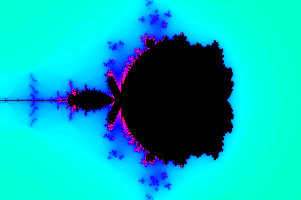
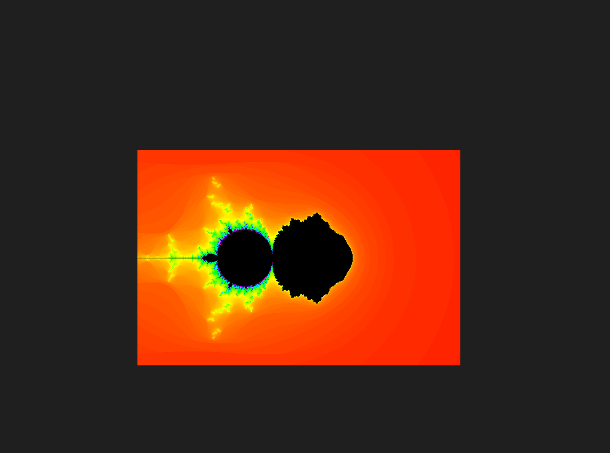
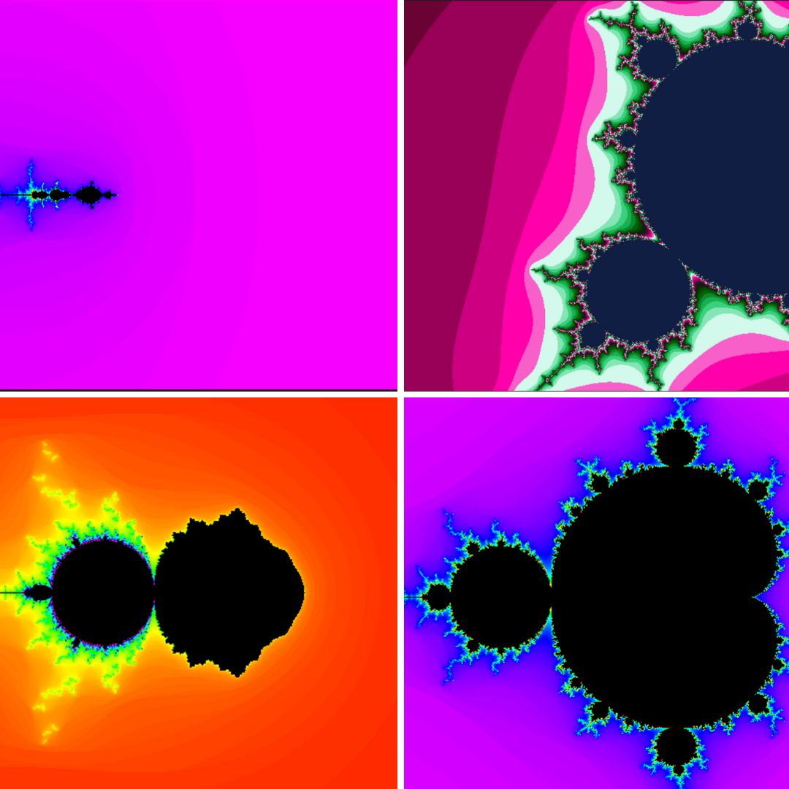
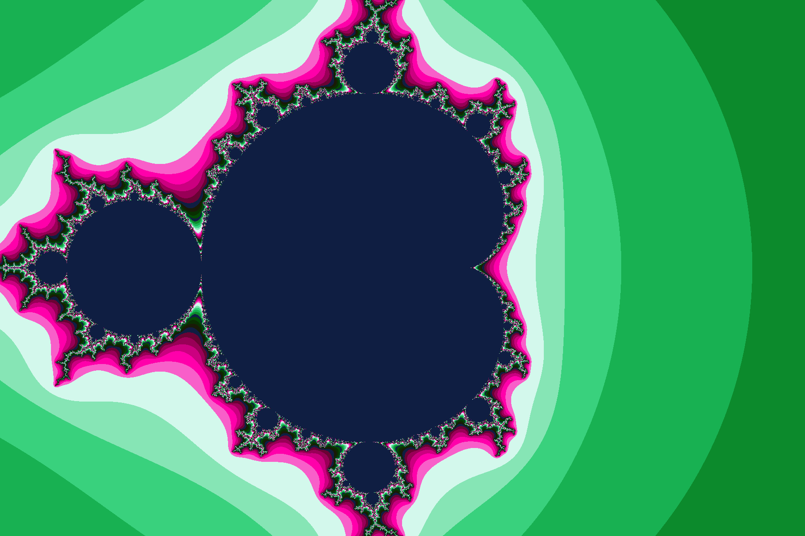

## Mandelbrot set

For the first pictures I worked with python and made pictures with different formulas , colors and etc.then I worked with C language (using python will help you to understand mandel project better).

Here you can find how I chose the colors in C language :
[color](https://stackoverflow.com/questions/16500656/which-color-gradient-is-used-to-color-mandelbrot-in-wikipedia)

Then I have writen 4 defs in C language  for rotation , changing center , zoom and hold :
[get the mandelbrot set](/assets/pdf/blog..txt).

For providing a clip I have writen play.cfg:
[get the play.cfg](/assets/pdf/play.txt).

## Sonic pi
To provid music for your clip in sonic pi you can use synths ,samples , live loops and etc. (tutorials in sonic pi can be assistant to you).

I used 3 live loops in background and different samples and synths for each def .

