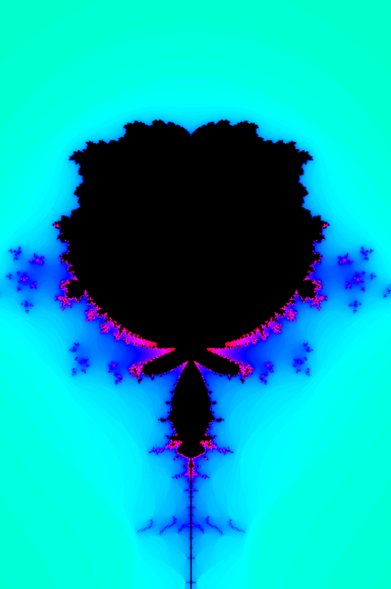

## Mandelbrot set

For the first picture I worked with python and made pictures with different formulas , colors & … then I worked with C language (using python will help you to understand mandel project better).

Here you can find how I chose the colors in C language :
[color](https://stackoverflow.com/questions/16500656/which-color-gradient-is-used-to-color-mandelbrot-in-wikipedia)

Then I have had write 4 defs in C language  for rotation , changing center , zoom and hold .

[get the mandelbrot set](/assets/pdf/blog.txt) .

## Sonic pi
for providing music you in sonic pi you can use synths ,samples , live loops &... (tutorials in sonic pi can help you).

I used 3 live loops for background and used  different samples and synths for each def .

